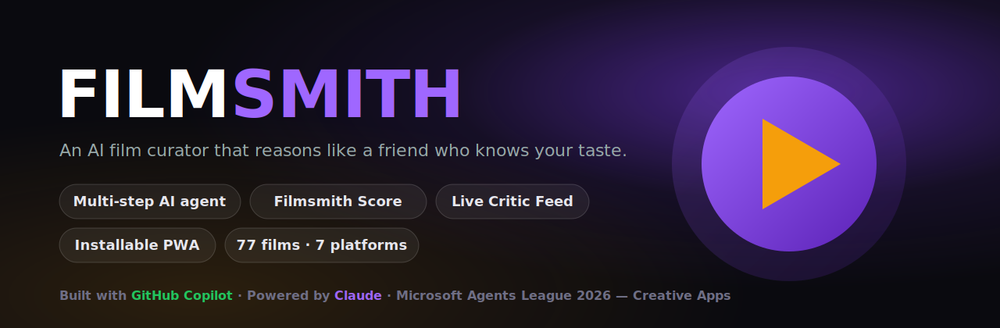
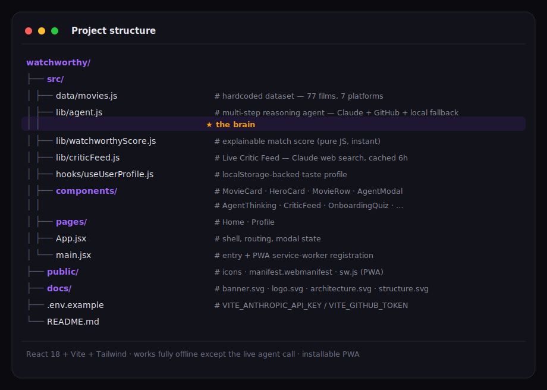
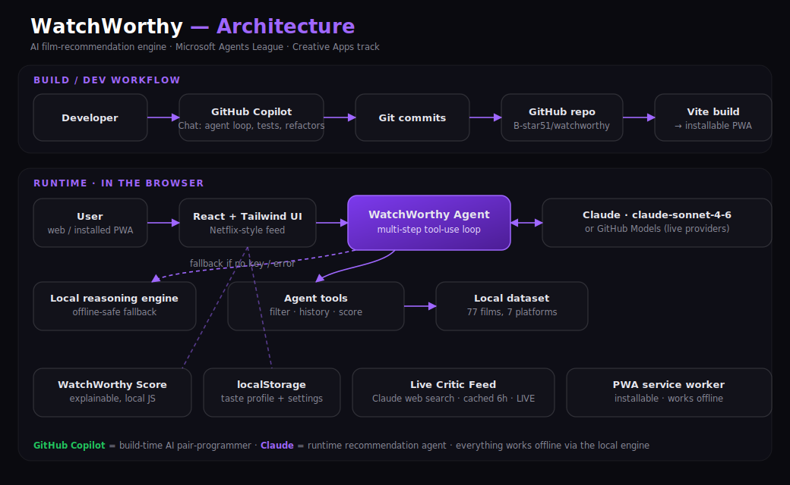
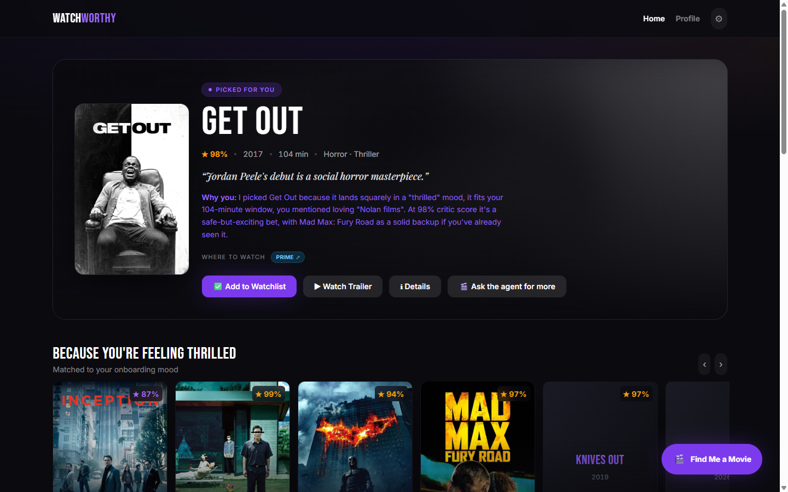
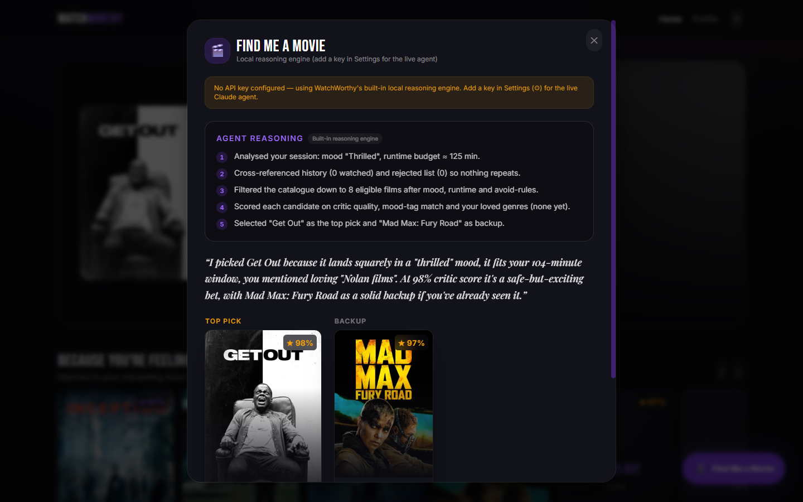
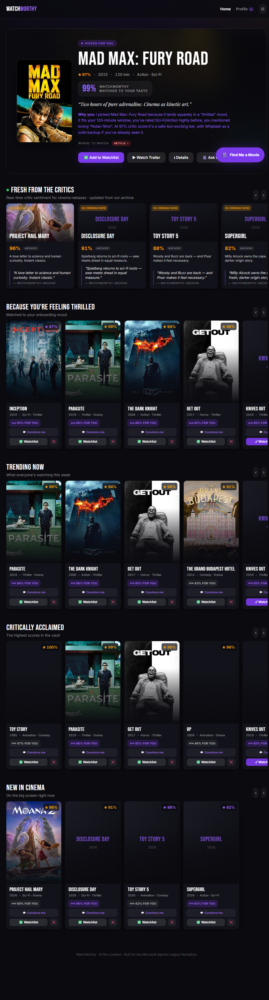
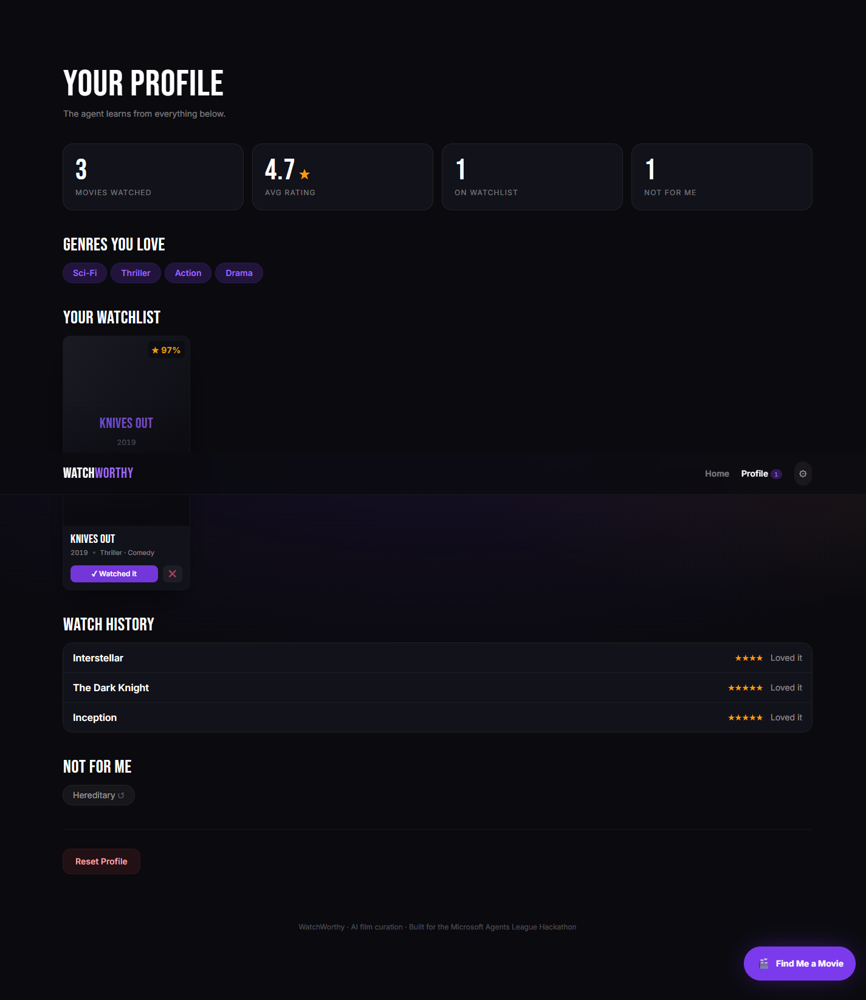

<p align="center">
  
</p>

# 🎬 WatchWorthy

**An AI movie recommendation engine that *reasons* its way to your next film.**

WatchWorthy is a Netflix-style web app with an embedded AI agent brain. Instead of a black-box "you might also like" rail, the agent thinks out loud — analysing your mood, your time budget, and everything you've watched and rejected — then shows you its reasoning chain before it recommends. Darker and more editorial than Netflix, it's built to feel like a premium film magazine went digital.

> Submission for the **Microsoft Agents League Hackathon — Creative Apps track**.

---

## The problem it solves

Recommendation feeds are opaque and shallow. They don't know that you only have 90 minutes tonight, that you're with your parents, or that you want to avoid anything sad. WatchWorthy treats recommendation as a **multi-step reasoning task**: it gathers context, filters, scores, and *explains*, the way a knowledgeable friend would.

---

## How the agent reasoning works

On the Claude path the agent runs a genuine **multi-step tool-use loop** — it isn't a single prompt. Claude calls tools, we execute them locally against the dataset and profile, feed the results back, and it iterates until it returns a final, structured answer. See [`src/lib/agent.js`](src/lib/agent.js) — the top-of-file comment documents the chain in detail.

**The tools Claude can call**

| Tool | What it does |
|------|--------------|
| `filter_by_mood_and_time` | Returns catalogue films matching the mood + runtime budget |
| `check_user_history` | Returns watched / rejected titles and the user's loved genres |
| `score_candidates` | Scores titles on critic quality and genre fit |

**The transparent reasoning chain it follows**

```
1. Parse the user's current mood and time available
2. Review watch history — note genre/rating patterns
3. Identify and exclude rejected films
4. Score remaining candidates (genre + mood + critic score)
5. Factor in live critic data for cinema releases
6. Select primary pick (highest combined score) + a backup
7. Write a personalised explanation referencing this user's specifics
```

The model returns strict JSON, which the UI renders as a numbered reasoning trace, an explanation, and the picks as full movie cards:

```json
{
  "reasoning_steps": ["Mood detected: thrilled — filtering for thrilled tags", "..."],
  "primary_pick": "Parasite",
  "backup_pick": "Knives Out",
  "watchworthy_score": 94,
  "explanation": "Because you loved slow-burn thrillers and only have 2 hours…"
}
```

### Two agent backends ("GitHub agents" too)

The same agent can be powered by either provider — switch in-app via **Settings (⚙)**:

| Provider | Model | Notes |
|----------|-------|-------|
| **Claude** | `claude-sonnet-4-6` | Primary brain — runs a real **tool-use agent loop** via the Anthropic Messages API |
| **GitHub Agent** | GitHub Models (`openai/gpt-4o-mini`) | Optional alternate, GitHub Models inference API |

### Reliability & safety

- The movie dataset is **fully local** — no external content API.
- If no key is set, or a live call fails, WatchWorthy falls back to a built-in **local reasoning engine** that mirrors the same multi-step chain deterministically. The app **always** returns a sensible recommendation and works offline.
- The agent is constrained to only recommend titles in the dataset and never re-recommends watched or rejected films.
- Poster URLs that 404 fall back gracefully to a dark title plaque.

---

## Features

- **"Find Me a Movie" agent flow** — 3 qualifying questions → a live, typewriter **Agent Thinking** trace (with real counts from your profile) → primary + backup picks.
- **WatchWorthy Score** — an explainable, personalised match score (`critic 40% + genre fit 35% + mood fit 25%`) on every card; larger on the hero with "Matched to your taste."
- **Convince Me** — flip any card for a personalised 3-sentence pitch written for *you* (Claude/GitHub when keyed; deterministic local pitch otherwise).
- **Fresh From the Critics** — a Live Critic Feed for cinema releases via Claude web search, cached 6h, with a pulsing **LIVE** badge (gracefully falls back to the bundled blurb).
- **Installable PWA** — manifest + service worker; installs to your desktop/phone and works offline.
- **77-film catalogue across 7 platforms** — Netflix, Prime Video, Disney+, Hulu, HBO Max, Paramount+, Apple TV+ (clickable "where to watch" links) plus cinema releases with showtime search.
- **Onboarding taste quiz** (mood / time / last-loved) — shown once, stored locally.
- **Home feed** — a personalised "Picked for You" hero plus Trending, Critically Acclaimed, mood-matched, and New in Cinema rows.
- **Signature movie cards** — hover to zoom the poster and reveal critic score, blurb, trailer, and streaming badges; click for a full detail view with the embedded trailer.
- **Post-watch feedback** — star rating, verdict, and next-mood; this data feeds future recommendations.
- **Profile page** — stats, loved genres, watchlist, and the "Not For Me" list (one-click un-reject) and profile reset.
- **Fully responsive** — bottom-drawer modals on mobile, centred dialogs on desktop.

---

## Tech stack

- **React 18 + Vite** (JSX)
- **Tailwind CSS** for styling (custom cinematic palette + Bebas Neue / Playfair Display / Inter)
- **react-router-dom** (HashRouter, GitHub-Pages-friendly)
- **Claude API** (`claude-sonnet-4-6`, tool use + web search) / **GitHub Models** as the agent brain
- **PWA** — web manifest + service worker (installable, offline-capable)
- **localStorage** for profile + key persistence
- Hardcoded 77-film dataset (7 platforms) — no external content API

---

## Run it locally

```bash
git clone <your-repo-url>
cd watchworthy
npm install

# optional — add a key for the LIVE agent (works without one via local fallback)
cp .env.example .env
#   then set VITE_ANTHROPIC_API_KEY=... (or VITE_GITHUB_TOKEN=...)
#   OR just paste a key in the in-app Settings (⚙) panel at runtime

npm run dev
```

Open the printed `localhost` URL. On first visit you'll get the taste quiz, then the home feed. Click **Find Me a Movie** (bottom-right) to watch the agent reason.

### Build & deploy

```bash
npm run build      # outputs to dist/
npm run preview    # preview the production build
```

`vite.config.js` sets `base: './'`, so the build works on **GitHub Pages** (a project subpath) or **Vercel** with no extra config.

---

## Project structure



---

## Architecture diagram



The diagram shows both halves the rules ask for:

- **Build / dev workflow** — **GitHub Copilot** as the AI pair-programmer (agent loop, tests, refactors) → Git → GitHub → Vite build → installable PWA.
- **Runtime** — the **WatchWorthy Agent** runs a multi-step tool-use loop against **Claude (`claude-sonnet-4-6`)** or GitHub Models, calling local tools (`filter` · `history` · `score`) over the bundled 77-film dataset, with a local reasoning engine as an offline-safe fallback, plus the WatchWorthy Score, the Live Critic Feed, and the PWA service worker.

> Source is [`docs/architecture.svg`](docs/architecture.svg) — editable vector you can tweak or drop into a slide.

---

## How GitHub Copilot was used

WatchWorthy was built with AI-assisted development. Concrete, verifiable Copilot contributions:

- **The agent tool-use loop** — the three tool schemas (`filter_by_mood_and_time`, `check_user_history`, `score_candidates`) and the call → observe → iterate loop in [`src/lib/agent.js`](src/lib/agent.js) were drafted with **GitHub Copilot Chat**, then integrated against the real dataset. See commit [`c57c16d`](../../commit/c57c16d) — co-authored by Copilot.
- Commits where Copilot contributed carry a `Co-Authored-By: Copilot` trailer, so it appears in the repo's **Insights → Contributors**.

### GitHub Copilot + MCP (Model Context Protocol)

GitHub Copilot's **agent mode** connects to **MCP servers** to pull live context and drive tools beyond the editor. WatchWorthy was developed in an MCP-enabled agent workflow:

- **GitHub MCP server** (`https://api.githubcopilot.com/mcp/`) — repository, commit and PR context, so the agent reasons over the real codebase rather than guesses.
- **Playwright MCP server** — launched the running app to verify the agent reasoning flow end-to-end, capture the screenshots below, and confirm the PWA installs and the service worker registers.

The repo is **MCP-friendly**: point Copilot's agent at it (VS Code → *Copilot → Agent → MCP*) and it can explore the dataset, components, and the agent loop directly.

> Add your own Copilot screenshots / clips for the final submission, and tag any further Copilot-assisted commits with the `Co-Authored-By: Copilot` trailer.

---

## Screenshots

| Home — personalised hero + rows | Agent reasoning trace + picks |
|---|---|
|  |  |
| **Fresh From the Critics + WatchWorthy scores** | **Profile — taste, watchlist, history** |
|  |  |

> A no-narration captioned demo video works well for the Discord community vote.

---

## License

MIT — do whatever you'd like.
